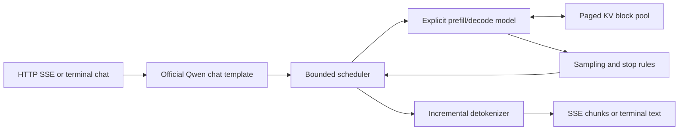

# ForgeEngine architecture

ForgeEngine is deliberately one process, one model, and one NVIDIA GPU. The
HTTP event loop never calls CUDA directly: one scheduler worker owns all model
and cache mutation. This keeps request ordering and cleanup visible without a
distributed runtime.

## Trace one serving request

1. `server.py` validates the streaming chat body, converts messages to the
   engine types, and asks `SchedulerRuntime` to admit the request.
2. `scheduler.py` applies the tokenizer's official chat template. Admission
   reserves the request's worst-case KV blocks before any model forward.
3. The sole scheduler worker selects a round-robin, token-budgeted batch.
   Compatible requests share one tensor-batched call; incompatible shapes use
   separate readable sub-batches.
4. `engine.py` runs explicit prefill for new requests or one-token decode for
   active requests. There is no call to `model.generate` or `pipeline`.
5. `qwen3.py` executes the supported Qwen3 layers loaded by `weights.py`.
   The integrated residual/RMSNorm and paged decode kernels use guarded custom
   paths and automatically fall back to their PyTorch references.
6. `cache.py` maps each sequence's logical token positions to fixed-size
   physical KV blocks. It gathers the readable baseline view, appends new KV,
   reuses holes, and releases ownership on every terminal path.
7. `sampling.py` filters logits for greedy or configured stochastic sampling.
   `engine.py` applies EOS, token limits, cross-token stop strings, and
   incremental detokenization.
8. `scheduler.py` records the request state and returns ordered text/lifecycle
   events. `server.py` converts them to OpenAI-compatible SSE chunks and
   releases terminal request history.

## Ownership and boundaries

| Component | Owns | Does not own |
| --- | --- | --- |
| `server.py` | HTTP validation, SSE framing, process metrics | CUDA execution |
| `scheduler.py` | admission, request state, batching, cancellation | model weights |
| `engine.py` | explicit generation state and stop behavior | HTTP |
| `qwen3.py` / `weights.py` | supported architecture and staged tensors | scheduling |
| `cache.py` | physical KV blocks and block tables | sampling |
| `sampling.py` | token choice from logits | detokenization |
| `kernels/` | guarded low-level operations and references | policy or transport |
| `rust/streamer` | external SSE consumption and load measurement | inference |

## Failure and cleanup path

Admission failures allocate no physical KV blocks. Normal finish, model error,
explicit cancellation, client disconnect, and process shutdown all converge on
one terminal transition that releases the sequence and its reservation exactly
once. Tests assert that waiting/running counts, reservations, and allocated
blocks return to zero.

## Intentional scope

There is no multi-GPU execution, distributed coordinator, quantization,
speculative decoding, prefix cache, authentication, or generic model registry.
The only supported package is the pinned Qwen model and revision documented in
the README.
