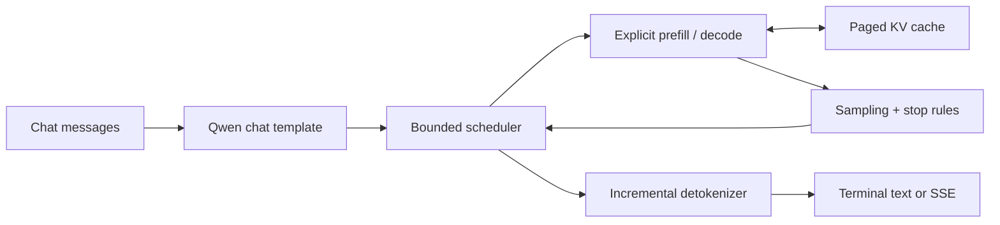

# ForgeEngine

[](https://github.com/marcoharuni/forge-engine/actions/workflows/ci.yml)

[](LICENSE)


A small, readable, single-GPU inference engine for `Qwen/Qwen3-4B-Instruct-2507`.

It implements the serving path explicitly: staged SafeTensors loading, Qwen3
forward execution, prefill and decode, paged KV caching, continuous batching,
sampling, incremental detokenization, and streamed chat—without `model.generate`.

## What it implements

| Component | Implementation |
| --- | --- |
| Model | Pinned Qwen3 4B Instruct |
| Weight loading | Staged SafeTensors loading |
| Prefill/decode | Explicit engine paths |
| KV cache | Paged block allocator with deterministic cleanup |
| Scheduling | Continuous, bounded, token-budgeted batching |
| Sampling | Greedy, temperature, top-k, top-p, and min-p |
| Kernels | Triton RMSNorm, CUDA paged GQA, restricted prefill lab |
| API | Streaming chat subset and `/v1/models` |
| Clients | Terminal, browser, and Rust SSE/load client |

## Architecture



The HTTP event loop never performs CUDA work directly. One scheduler worker owns
model execution and KV-cache mutation. See
[docs/architecture.md](docs/architecture.md).

## Quickstart

Requirements: Linux, `uv`, one compatible NVIDIA GPU, and enough memory for the
4B BF16 model and KV cache. The first run downloads the pinned model; later
runs reuse `HF_HOME`.

```bash
git clone https://github.com/marcoharuni/forge-engine.git
cd forge-engine

uv venv --python 3.11
source .venv/bin/activate
uv pip install -r requirements-gpu.txt
uv pip install --no-deps .

export HF_HOME="$PWD/.hf-cache"
python -c "import torch; assert torch.cuda.is_available(); print(torch.cuda.get_device_name(0))"
forge-engine doctor
forge-engine chat --max-new-tokens 256
```

Type a message after `You:`. Press `Ctrl+D` to exit.

## Browser and streaming API

Start the server:

```bash
forge-engine serve --host 127.0.0.1 --port 8000
```

> ForgeEngine has no authentication or TLS. Keep it bound to `127.0.0.1` unless
> it is behind a trusted reverse proxy.

Open `http://127.0.0.1:8000` for browser chat, or send a streaming request:

```bash
curl -N http://127.0.0.1:8000/v1/chat/completions \
  -H 'Content-Type: application/json' \
  -d '{
    "model": "Qwen/Qwen3-4B-Instruct-2507",
    "messages": [{"role": "user", "content": "Explain paged KV caching."}],
    "stream": true,
    "max_tokens": 128
  }'
```

Health, metrics, and model discovery are available at `/health`, `/metrics`,
and `/v1/models`.

## Verified L4 results

The release path was validated on one NVIDIA L4 24 GB using BF16, CUDA 13.0,
PyTorch `2.13.0+cu130`, Transformers `5.14.1`, and model revision
`cdbee75f17c01a7cc42f958dc650907174af0554`.
Other NVIDIA GPUs are not currently validated.

| Measurement | Verified result |
| --- | ---: |
| Python tests | 91 passed |
| Parameter-validation subtests | 16 passed |
| Rust tests | 3 passed |
| End-to-end throughput | 19.31 generated tokens/s |
| Measured concurrency | 4 |
| Peak process CUDA allocation | 8.88 GB |
| Failed requests | 0 |
| Final allocated KV blocks | 0 |

The eight-request workload had six finishes and two deliberate cancellations.
These are workload-specific results, not a general capacity claim. See
[docs/benchmarks.md](docs/benchmarks.md) for methodology and latency data.

## Supported scope

- Only `Qwen/Qwen3-4B-Instruct-2507` at the pinned revision is supported.
- Execution is one process on one NVIDIA CUDA GPU.
- There is no distributed inference, quantization, speculative decoding, prefix
  caching, multimodal input, or non-NVIDIA backend.
- The streaming API has no built-in authentication, TLS, persistence, quotas,
  or multi-tenant isolation.
- Custom kernels fall back to PyTorch; JIT compilation needs a CUDA development
  toolkit, `g++`, and Ninja.

## Documentation

- [Architecture](docs/architecture.md)
- [Benchmarks and release evidence](docs/benchmarks.md)
- [Kernel implementation and limits](docs/kernels.md)
- [Validation](docs/validation.md)
- [Development](docs/development.md)
- [Rust client](rust/streamer/README.md)

## License

ForgeEngine and its Rust client use the [Apache License 2.0](LICENSE). The
pinned Qwen model is also Apache 2.0 and retains its snapshot license.
